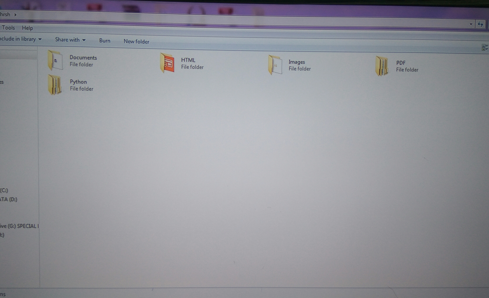

# organiser

Junk File Organizer in Python -
Basically, as a lazy programmer my desktop is full of files (Junk Files). Due to the large number of files, it is a daunting task to sit and organize each file. To make that task easy the below Python script comes handy and all the files are organized in a well-manner within seconds.

Screenshot before running the script

lazy junk organizer
Following are the steps to be followed:

1- Create Dictionaries: The code below will create the defined Directories.
DIRECTORIES = 
{
    
    "HTML": [".html5", ".html", ".htm", ".xhtml"],
      "IMAGES": [".jpeg", ".jpg", ".tiff", ".gif", ".bmp", ".png", ".bpg", "svg",
               ".heif", ".psd"],
     "VIDEOS": [".avi", ".flv", ".wmv", ".mov", ".mp4", ".webm", ".vob", ".mng",
               ".qt", ".mpg", ".mpeg", ".3gp"],
     "DOCUMENTS": [".oxps", ".epub", ".pages", ".docx", ".doc", ".fdf", ".ods",
                  ".odt", ".pwi", ".xsn", ".xps", ".dotx", ".docm", ".dox",
                  ".rvg", ".rtf", ".rtfd", ".wpd", ".xls", ".xlsx", ".ppt",
                  "pptx"],
     "ARCHIVES": [".a", ".ar", ".cpio", ".iso", ".tar", ".gz", ".rz", ".7z",
                 ".dmg", ".rar", ".xar", ".zip"],
     "AUDIO": [".aac", ".aa", ".aac", ".dvf", ".m4a", ".m4b", ".m4p", ".mp3",
              ".msv", "ogg", "oga", ".raw", ".vox", ".wav", ".wma"],
     "PLAINTEXT": [".txt", ".in", ".out"],
     "PDF": [".pdf"],
     "PYTHON": [".py"],
     "XML": [".xml"],
     "EXE": [".exe"],
     "SHELL": [".sh"]
     }

 2- Mapping: Now we will map the file formats with directory.
FILE_FORMATS = 
{
             file_format: directory
                for directory, file_formats in DIRECTORIES.items()
                  for file_format in file_formats
}

3 - Here, I map file extensions with directory.

       def organize_junk():
          for entry in os.scandir():
        if entry.is_dir():
          continue
         file_path = Path(entry)
        file_format = file_path.suffix.lower()
          if file_format in FILE_FORMATS:
        directory_path = Path(FILE_FORMATS[file_format])
           directory_path.mkdir(exist_ok=True)
        file_path.rename(directory_path.joinpath(file_path))

        

         
        for dir in os.scandir():
            try:
                os.rmdir(dir)
            except:
                pass

The above function will check for the existing directory for the same name we defined. If the existing directory is found then it will continue or else new directory is created. And it will categorize all the files based on the extension in the appropriate folder.

Organizing: Following is the code for Python Lazy Junk Files Organizer. It will organize everything in appropriate folder in a single go and remove empty directories.
THE CODE IS PROVIDED IN MAIN FILE...

 4 - Save the above script as orgjunk.py. For example you want to organize files at desktop then copy and paste the orgjunk.py at Desktop and run.

Screenshot after running the script

